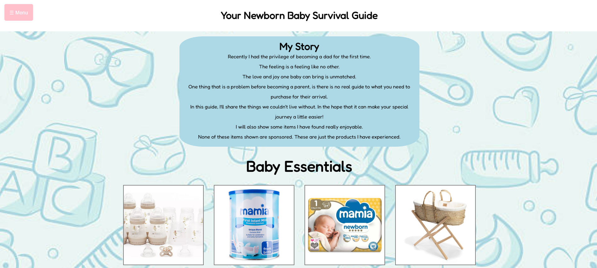
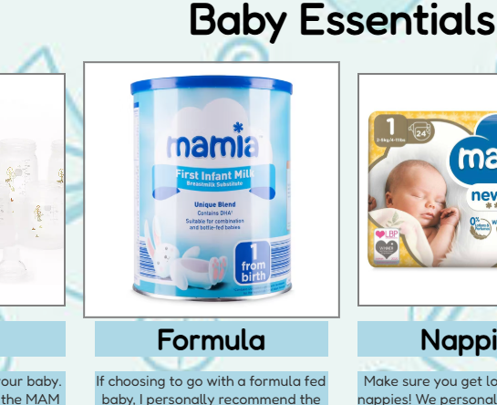
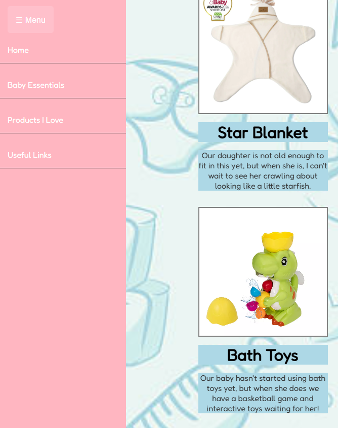

# your-newborn-baby-survival-guide
A website I developed using HTML, CSS, and JavaScript to help expectant parents understand what they need for their new baby.

The website begins for a header and introduction to the page.

All the images on the page are interactive. When hovered over, the image has a zoom in effect to help readers view the image. When clicked, the image will take you directly to the website selling the product.

The website has a functional Javascript navigation bar. This is accessed by pressing the 'Menu' icon in the top left of the page. This will follow the page when scrolled up/down making it accessible at all times. 
When clicked, the navbar will smoothly scroll you to the position on the page you have requested. The navbar will also go back inside the menu icon when pressed. I have done this so it is not always on the page and makes the presentation more appealing. 

After the interactive images, there is a  'Useful Links' section which takes you to any websites first-time parents may find useful. When the links are hovered over, they are also interactive. The link will drop down a little bit giving the impression that the button  wants to be pressed.

At the bottom of the page, there is a footer. This footer contains a small qoute from my girlfriends favourite - Winnie The Pooh. I wanted this footer to also be interactive, but subtle. When hovered over, the footer will spawn a bunch of flowers just to add that little bit of magic! 

The pages media queries have been set up, making the website presentable on desktop, tablet and mobile. 

I really enjoyed making this website. It feels nice to create a interactive, dynamic website using just HTML, CSS & Javascript. This will definitely be going on my portfoilio website - hopefully another step in the right direction to changing my career! 
